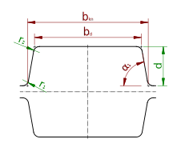

# The `BoxGroove` class

The `BoxGroove` class represents a rectangular shaped groove as shown in the figure.
For wear reasons, the flanks a typically inclined by a small angle.

Mandatory measures of the box groove are the two radii $`r_1`$ and $`r_2`$, as well as the depth $`d`$.
To constrain geometry fully, any two of the following must be given:
- usable width $`b_\mathrm{kn}`$
- ground width $`b_d`$
- flank angle $`\alpha_1`$ 

So the constructor has the following signature:

    BoxGroove(r1, r2, depth, usable_width, ground_width, flank_angle)

The radii are typically small, the depth is $`d`$  typically $`\le \frac{b_\mathrm{kn}}{2}`$.

$`r_3`$ and $`r_4`$ are considered to be zero.

$`b_d`$ was chosen in favor of the even ground width $`b_d'`$, because it does not change when the radii are modified.
So the overall geometry remains the same if one modifies only the radii.