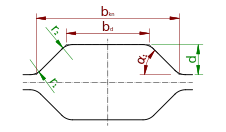

# The `SwedishOvalGroove` class

The `SwedishOvalGroove` class represents a hexagonal shaped groove as shown in the figure. The term "hexagonal" is also
used for this type of groove, but can be confused with regular hexagon shaped grooves. The current type of groove is
used as an oval and therefore the term swedish oval should be used, which is derived from its origin in swedish steel
plants.

Mandatory measures of this groove are the two radii $`r_1`$ and $`r_2`$, as well as the depth $`d`$. To constrain
geometry fully, any two of the following must be given:

- usable width $`b_\mathrm{kn}`$
- ground width $`b_d`$
- flank angle $`\alpha_1`$

So the constructor has the following signature:

    SwedishOvalGroove(r1, r2, depth, usable_width, ground_width, flank_angle)

The radii are typically small, the depth is $`d`$ typically $`<< \frac{b_\mathrm{kn}}{2}`$.

$`r_3`$ and $`r_4`$ are considered to be zero.

$`b_d`$ was chosen in favor of the even ground width $`b_d'`$, because it does not change when the radii are modified.
So the overall geometry remains the same if one modifies only the radii.

The topology of this groove is similar to the [`BoxGroove`](../boxes/box.md), but typically the flank angles are smaller
and the groove is less deep.

