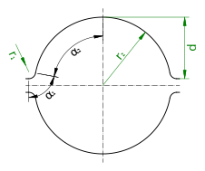

# The `RoundGroove` class

The `RoundGroove` class represents a groove with a circular cross-section as shown in the figure.



It is defined by two radii $`r_1`$ and $`r_2`$ and the depth $`d`$, so the constructor has the following signature:

    RoundGroove(r1, r2, depth)

The geometric constraints are $`r_1 << r_2`$ and $`d < r_2`$.

$`r_3`$ and $`r_4`$ are considered to be zero, as well as $`b_d`$ and $`b_d'`$.

The angles can be calculated as following:

```math
    \alpha_1 = \alpha_2 = \arccos \left( 1 - \frac{d}{r_1 + r_2} \right)
```

The usable width is then:

```math
    b_\mathrm{kn} = 2 \left( r_1 \sin \alpha_1 + r2 \sin \alpha_2 - r_1 \tan \frac{\alpha_1}{2} \right)
```

